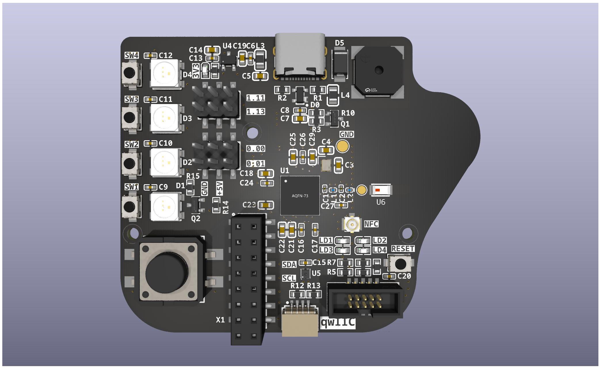

# CoffeeCaller

This repository holds the KiCad design files for the CoffeeCaller. Once a nice
office gadget it now evolved to a small development board for the 
[Nordic nRF52840](https://www.nordicsemi.com/Products/nRF52840) featuring buttons,
LEDs, buzzer and an onboard temperature sensor.



## Features

SoC: [Nordic nRF52840](https://www.nordicsemi.com/Products/nRF52840)
- 64 MHz Cortex-M4 with FPU
- 1 MB Flash, 256 KB RAM
- 2.4 GHz Transceiver

Power
- `5 V` power supply via USB-C connector
- LDO to provide `3.3 V` with `200 mA`

Interactions
- 1 large button
- 4 small buttons
- 4 LEDs controlled via GPIO
- 4 WS2812 RGB LEDs
- 1 buzzer controlled via GPIO-PWM
- 1 SHT-40 temperatur and humidity sensor via I2C

Connectivity
- 2.4 GHz chip antenna
- NFC via IPEX-1 connector
- qwIIC
- 10-pin JTAG header (1.27 mm) for SWD
- 4 male pin headers (2.54 mm) for e.g. servos
- 16 pin female header (2.54 mm) with 9 free to use GPIOs, `5 V`, `3.3 V`, `I2C`, `SWD`

PCB
- 2 layers
- no THT components
- components only on top layer
- empty space between antenna and buzzer to place your logo

## KiCad Setup

The footprints and symbolds can be imported from EasyEDA's and LCSC's parts database.
To do this the tool [easyeda2kicad](https://pypi.org/project/easyeda2kicad/) can be
used. Please read the instructions on how to setup KiCad to use the new footprint and
symbol library provided by easyeda2kicad.

To import all currently in use components just download the closed matching BOM.csv from 
the [releases](https://github.com/tiacsys/ecad-coffeecaller/releases) of this repo and
call:

```bash
gawk -vFPAT='[^,]*|"[^"]*"' '{print $4}' BOM-coffeecaller.csv | tail -n +2 | xargs -i easyeda2kicad --full --lcsc_id={}
```

This will iterate over the CSV and calls `easyeda2kicad` to import the component.

To generate your own production files for [JLCPCB](https://jlcpcb.com) you can use the
[kicad-jlcpcb-tools](https://github.com/Bouni/kicad-jlcpcb-tools). Installation 
instructions can be found in the GitHub repo.